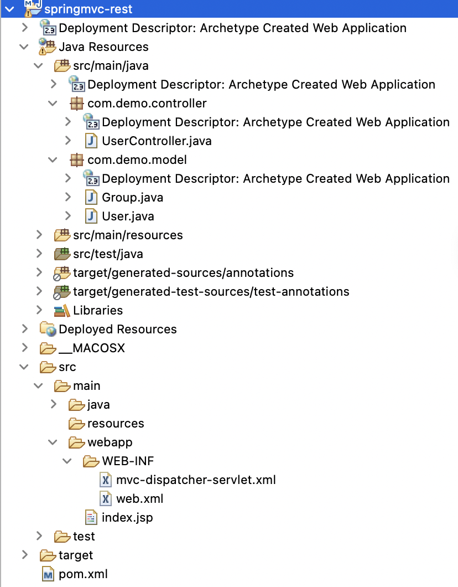
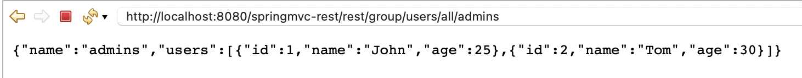

# spring-mvc-rest

This project uses *Spring latest version 4.0.0.RELEASE* and utilize *Spring Jackson JSON* integration to send JSON response in the rest call response. This project is developed in *Spring STS IDE* for creating *Spring MVC* skeleton code easily and then extended to implement *Restful architecture*.

## Porject Structure


## Spring REST Configuration XML file
The `pom.xml` file looks like below
```
<project xmlns="http://maven.apache.org/POM/4.0.0"
	xmlns:xsi="http://www.w3.org/2001/XMLSchema-instance"
	xsi:schemaLocation="http://maven.apache.org/POM/4.0.0 http://maven.apache.org/maven-v4_0_0.xsd">
	<modelVersion>4.0.0</modelVersion>
	<groupId>java.web.apps</groupId>
	<artifactId>springmvc-rest</artifactId>
	<packaging>war</packaging>
	<version>0.0.1-SNAPSHOT</version>
	<name>springmvc-rest Maven Webapp</name>
	<url>http://maven.apache.org</url>

	<dependencies>

		<dependency>
			<groupId>org.springframework</groupId>
			<artifactId>spring-webmvc</artifactId>
			<version>5.0.2.RELEASE</version>
		</dependency>

		<!-- Jackson JSON Mapper -->
		<dependency>
			<groupId>org.codehaus.jackson</groupId>
			<artifactId>jackson-mapper-asl</artifactId>
			<version>1.9.10</version>
		</dependency>

		<dependency>
			<groupId>com.fasterxml.jackson.core</groupId>
			<artifactId>jackson-databind</artifactId>
			<version>2.10.0.pr3</version>
		</dependency>

		<dependency>
			<groupId>junit</groupId>
			<artifactId>junit</artifactId>
			<version>3.8.1</version>
			<scope>test</scope>
		</dependency>
	</dependencies>
	<build>
		<finalName>springmvc-rest</finalName>
	</build>
</project>
```

## MVC Dispatcher Servlet Configuration
```
<?xml version="1.0" encoding="UTF-8"?>
<beans xmlns="http://www.springframework.org/schema/beans"
	xmlns:xsi="http://www.w3.org/2001/XMLSchema-instance"
	xmlns:context="http://www.springframework.org/schema/context"
	xmlns:mvc="http://www.springframework.org/schema/mvc"
	xsi:schemaLocation="http://www.springframework.org/schema/beans http://www.springframework.org/schema/beans/spring-beans.xsd
		http://www.springframework.org/schema/context http://www.springframework.org/schema/context/spring-context-4.3.xsd
		http://www.springframework.org/schema/mvc http://www.springframework.org/schema/mvc/spring-mvc-4.3.xsd">

	<context:component-scan base-package="com.demo" />
	<mvc:annotation-driven />

</beans>
```

## web.xml
```
<!DOCTYPE web-app PUBLIC
 "-//Sun Microsystems, Inc.//DTD Web Application 2.3//EN"
 "http://java.sun.com/dtd/web-app_2_3.dtd" >

<web-app>
	<display-name>Archetype Created Web Application</display-name>

	<servlet>
		<servlet-name>mvc-dispatcher</servlet-name>
		<servlet-class>org.springframework.web.servlet.DispatcherServlet</servlet-class>
		<load-on-startup>1</load-on-startup>
	</servlet>

	<servlet-mapping>
		<servlet-name>mvc-dispatcher</servlet-name>
		<url-pattern>/rest/*</url-pattern>
	</servlet-mapping>

	<welcome-file-list>
		<welcome-file>index.jsp</welcome-file>
	</welcome-file-list>


</web-app>
```


## Spring Restful Web Service End Point
| Endpoint | Method | Description |
|---|---|---|
| /rest/group/users/all/{groupName} | GET | Get users in group by groupName |

## Spring Restful Web Service Controller Class
```
package com.demo.controller;

import java.util.ArrayList;
import java.util.Arrays;

import org.springframework.stereotype.Controller;
import org.springframework.web.bind.annotation.PathVariable;
import org.springframework.web.bind.annotation.RequestMapping;
import org.springframework.web.bind.annotation.RequestMethod;
import org.springframework.web.bind.annotation.ResponseBody;

import com.demo.model.Group;
import com.demo.model.User;

@Controller
@RequestMapping("/group/users")
public class UserController {
	
	ArrayList<User> users = new ArrayList<> (
		Arrays.asList(
			new User(1, "John", 25),
			new User(2, "Tom", 30)
		)
	);
	
	@RequestMapping(value = "/all/{groupName}", method = RequestMethod.GET)
	public @ResponseBody Group getUsersInGroup(@PathVariable String groupName) {
		Group group = new Group();
		group.setName(groupName);
		group.setUsers(users);
		return group;
	}
}
```

## API Call
